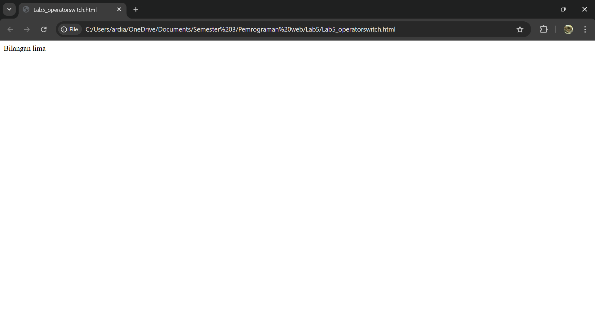
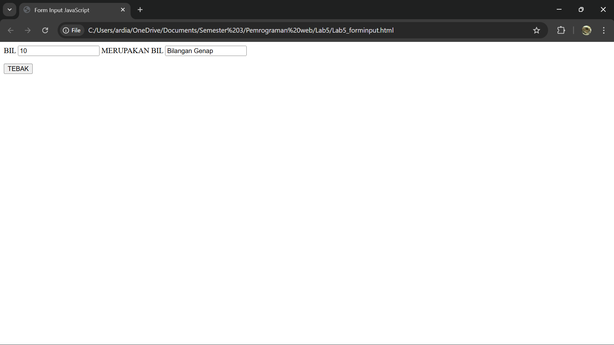
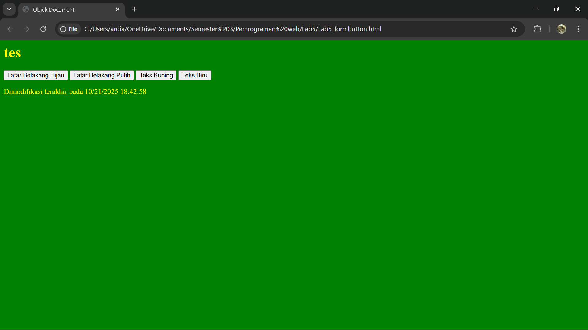
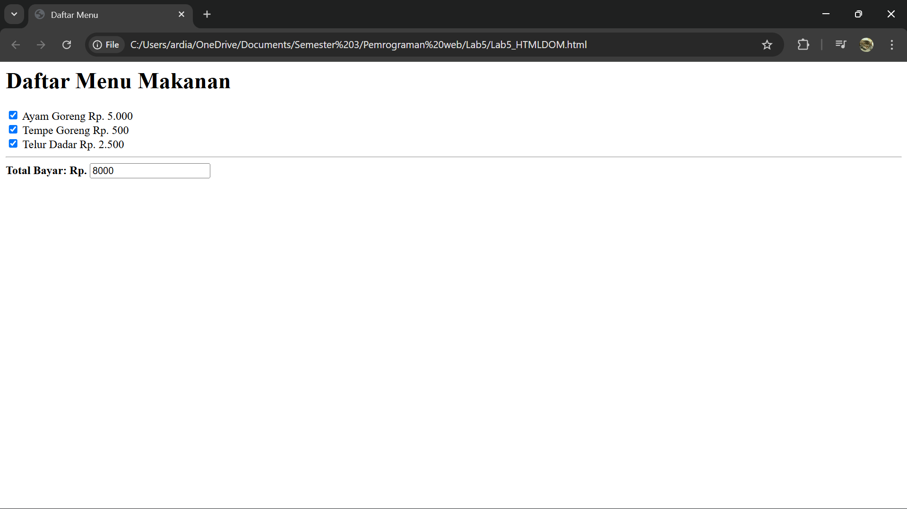
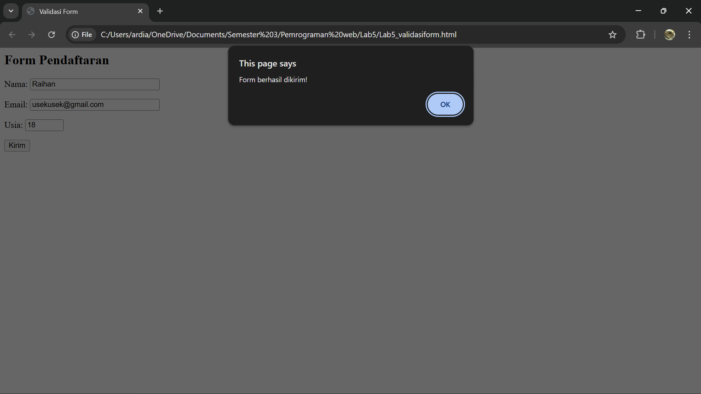

# Pratikum 5 - Javascript
### NAMA : Raihan Ardiansyah
### NIM : 312410396
### KELAS : TI.24.A3

## 📍LANGKAH - LANGKAH PENGERJAAN

### 1. Persiapan membuat dokumen HTML dengan nama filelab5_javascript.html seperti berikut.

 

**Javascrip Dasar**

#### Pemakaian Alert sebagai property window.

 

#### Pemakaian method dalam objek

 

#### Pemakaian Prompt

 

#### Pembuatan fungsi dan cara pemanggilannya

 

**Dasa Pemrograman Di Javascript**

#### Operasi darat aritmatika

 

#### Seleksi kondisi (if...else)

 

#### penggunaan operatorswitch untuk seleksi kondisi

 

**Pembuatan form**

#### Form input
 

 

#### Form Button

 

**HTML DOM**

#### Pilihan Menggunakan checkbox dengan perhitungan otomatis

 

## PERTANYAAN DAN TUGAS

### 1. Buat script untuk melakukan validasi pada isian form.

 

