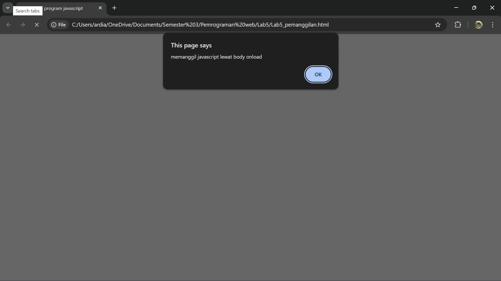
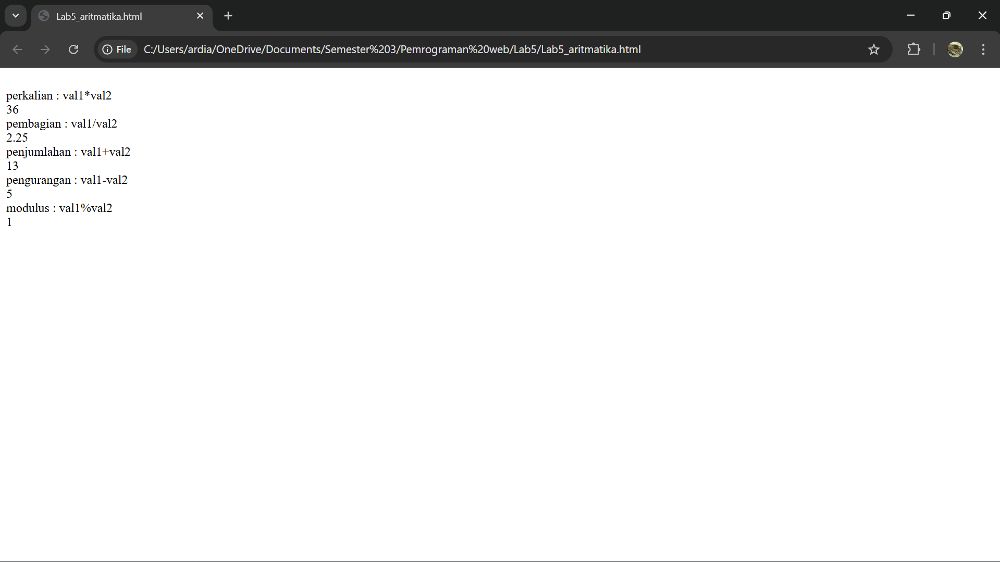

# Pratikum 5 - Javascript
### NAMA : Raihan Ardiansyah
### NIM : 312410396
### KELAS : TI.24.A3

## 📍LANGKAH - LANGKAH PENGERJAAN

### 1. Persiapan membuat dokumen HTML dengan nama filelab5_javascript.html seperti berikut.

**Membuat Box Element**

#### Kemudian tambahkan kode untuk membuat box element dengan tag div seperti berikut..

**CSS Float Property**

#### Selanjutnya tambahkan deklarasi CSS pada head untuk membuat float element, seperti berikut.

**SCREENSHOOT BROWSER**

#### Kemudian buka browser untuk melihat hasilnya.

**Mengatur Clearfix Element**

#### Clearfix digunakan untuk mengatur element setelah float element. Property clear digunakan untuk mengaturnya.

#### Tambahkan element div lainnya seteleah div3 seperti berikut.

#### Kemudian atur property clear pada CSS, seperti berikut.

#### Selanjutnya buka browser dan refresh kembali.

**Membuat Layout Sederhana**

## 2. Kita akan membuat layout web sederhana seperti gambar berikut.

#### Buat folder baru dengan nama lab4_layout, kemudian buatlah file baru didalamnya dengan nama home.html, dan file css dengan nama style.css.
 

#### Kemudian buat kerangka layout dengan semantics element seperti berikut.

#### Kemudian tulis kode berikut.

#### Kemudian buka browser dan lihat hasilnya.

#### Kemudian tambahkan kode CSS untuk membuat layoutnya.

#### Kemudian lihat hasilnya pada browser.

**Membuat Navigasi**

#### Kemudian selanjutnya mengatur navigasi.

#### Kemudian lihat hasilnya.

**Membuat Hero Panel**

#### Selanjutnya membuat hero panel. Tambahkan kode HTML dan CSS seperti berikut.

 

**Mengatur Layout Main dan Sidebar**

#### Selanjutnya mengatur main content dan sidebar, tambahkan CSS float.

**Membuat Sidebar Widget**

#### Kemudian selanjutnya menambahkan element lain dalam sidebar.

#### Kemudian tambahkan CSS.

 

**Mengatur Footer**

#### Selanjutnya mengatur tampilan footer. Tambahkan CSS untuk footer.

 

**Menambahkan Elemen lainnya pada Main Content**

#### Kemudian tambahkan CSS.

 

**Menambahkan Content Artikel**

#### Selanjutnya membuat content artikel. Tambahkan HTML berikut pada main content.

#### Kemudian tambahkan CSS.

 

## PERTANYAAN DAN TUGAS

### 1. Tambahkan Layout untuk menu About
##### => buat single layout yang berisi deskripsi, portfolio, dll
### 2. Tambahkan layout untuk menu Contact
#### => yang berisi form isian: nama, email, message, dll

#### Kemudian tambahkan CSS.

#### Lihat hasilnya dibrowser.

